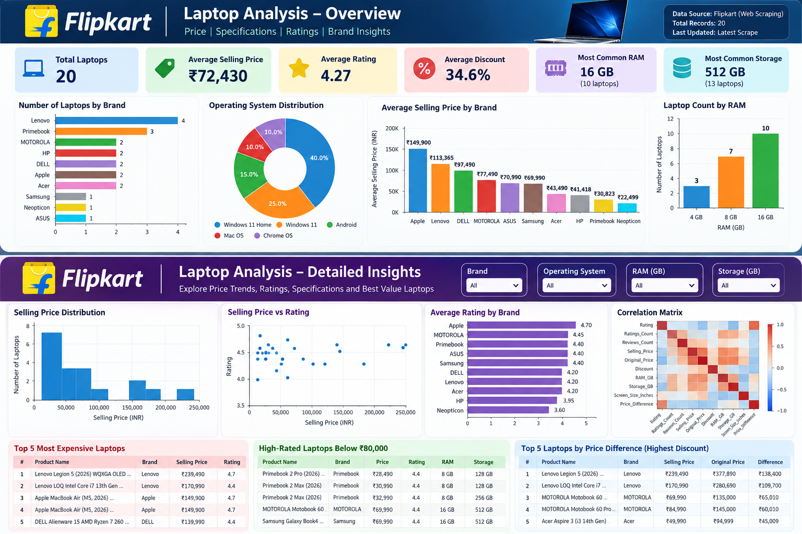

# Flipkart Laptop Analysis — Web Scraping & Data Analytics

An end-to-end data analytics project that collects laptop listings from Flipkart, transforms raw web data into an analysis-ready dataset, performs exploratory and SQL analysis, and presents the results through Power BI and business insights.

---

## Project Overview

This project demonstrates a complete data analytics workflow from **web scraping to business insights**.

The workflow includes:

- Web scraping using Python
- Data cleaning and transformation using Pandas
- Exploratory Data Analysis (EDA)
- Data visualization using Matplotlib
- SQL analysis using SQLite
- Power BI dashboard development
- Business insights and recommendations
- Final project reporting
- Git and GitHub version control

The goal is to transform raw e-commerce product listings into structured data and meaningful analytical insights.

---

## Project Objectives

The project was developed to:

1. Collect laptop product information from Flipkart.
2. Build a structured dataset from scraped web data.
3. Clean and transform the raw dataset.
4. Analyze pricing, ratings, brands, RAM, storage, and operating systems.
5. Perform business-oriented SQL analysis.
6. Build a Power BI dashboard.
7. Generate business insights and recommendations.
8. Document the complete end-to-end workflow.

---

## End-to-End Workflow

```text
Flipkart
   ↓
Web Scraping
   ↓
Raw Dataset
   ↓
Data Cleaning & Transformation
   ↓
Exploratory Data Analysis
   ↓
SQL Business Analysis
   ↓
Power BI Dashboard
   ↓
Business Insights
   ↓
Final Report
```

---

## Project Structure

```text
Flipkart/
│
├── data/
│   ├── raw_flipkart_laptops.csv
│   ├── cleaned_flipkart_laptops.csv
│   ├── data_dictionary.csv
│   └── flipkart_laptops.db
│
├── images/
│   ├── brand_distribution.png
│   ├── correlation_matrix.png
│   ├── dashboard.png
│   ├── price_vs_ram.png
│   ├── price_vs_rating.png
│   ├── price_vs_storage.png
│   ├── rating_distribution.png
│   ├── selling_price_boxplot.png
│   └── selling_price_distribution.png
│
├── notebooks/
│   ├── 01_data_cleaning.py
│   ├── 02_eda.py
│   ├── 03_eda_visualizations.py
│   ├── 04_eda_relationships.py
│   └── 05_eda_correlation.py
│
├── powerbi/
│
├── reports/
│   ├── business_insights.md
│   └── final_report.md
│
├── scraper/
│   └── flipkart_scraper.py
│
├── sql/
│   ├── 01_basic_queries.sql
│   ├── 01_create_database.py
│   ├── 02_run_basic_queries.py
│   ├── 03_business_analysis.py
│   └── 04_check_duplicate_products.py
│
├── .gitignore
└── README.md
```

---

## Dataset

The project contains both the original scraped dataset and the cleaned analysis-ready dataset.

### Raw Dataset

```text
data/raw_flipkart_laptops.csv
```

### Cleaned Dataset

```text
data/cleaned_flipkart_laptops.csv
```

### Data Dictionary

```text
data/data_dictionary.csv
```

The dataset contains information such as:

- Brand
- Product Name
- Rating
- Ratings Count
- Reviews Count
- Processor
- RAM
- Operating System
- Storage
- Screen Size
- Selling Price
- Original Price
- Discount
- Product URL

Additional analytical columns are created during data cleaning.

---

## Web Scraping

The scraper was developed using:

- Python
- Requests
- BeautifulSoup
- Regular Expressions
- Pandas

The scraper performs tasks such as:

- Extracting laptop product information
- Handling unavailable listings
- Cleaning product names
- Extracting ratings and review information
- Extracting processor, RAM, OS, storage, and screen size
- Extracting selling price and original price
- Calculating discount information
- Normalizing product URLs
- Removing duplicate products

### Scraper

```text
scraper/flipkart_scraper.py
```

Run the scraper:

```powershell
python scraper/flipkart_scraper.py
```

The raw dataset is saved to:

```text
data/raw_flipkart_laptops.csv
```

---

## Data Cleaning

The raw dataset is cleaned and transformed using Pandas.

The cleaning process includes:

- Removing unnecessary whitespace
- Standardizing text fields
- Converting numeric values
- Extracting RAM in GB
- Extracting storage capacity in GB
- Extracting screen size in inches
- Checking duplicate records
- Calculating price difference
- Creating analysis-ready variables

### Cleaning Script

```text
notebooks/01_data_cleaning.py
```

Run:

```powershell
python notebooks/01_data_cleaning.py
```

The cleaned dataset is saved to:

```text
data/cleaned_flipkart_laptops.csv
```

---

## Exploratory Data Analysis

EDA is used to understand the patterns and structure of the dataset.

The analysis covers:

- Brand distribution
- Operating system distribution
- RAM distribution
- Storage distribution
- Selling price distribution
- Rating distribution
- Average selling price by brand
- Average rating by brand
- Price vs RAM
- Price vs storage
- Price vs rating
- Correlation analysis

### EDA Scripts

```text
notebooks/02_eda.py
notebooks/03_eda_visualizations.py
notebooks/04_eda_relationships.py
notebooks/05_eda_correlation.py
```

Run:

```powershell
python notebooks/02_eda.py
python notebooks/03_eda_visualizations.py
python notebooks/04_eda_relationships.py
python notebooks/05_eda_correlation.py
```

---

## Data Visualizations

The project generates the following visualizations:

- Brand distribution
- Selling price distribution
- Rating distribution
- Price vs RAM
- Price vs Storage
- Price vs Rating
- Selling price boxplot
- Correlation matrix

All visualizations are stored in:

```text
images/
```

---

## SQL Analysis

The cleaned dataset is converted into a SQLite database for structured analysis.

### Database

```text
data/flipkart_laptops.db
```

### SQL Analysis Includes

- Laptop listings by brand
- Average selling price by brand
- Average selling price by RAM
- Average discount by brand
- Largest price differences
- High-rated laptops below ₹80,000
- Duplicate product checks

### SQL Files

```text
sql/01_basic_queries.sql
sql/01_create_database.py
sql/02_run_basic_queries.py
sql/03_business_analysis.py
sql/04_check_duplicate_products.py
```

Run:

```powershell
python sql/01_create_database.py
python sql/02_run_basic_queries.py
python sql/03_business_analysis.py
python sql/04_check_duplicate_products.py
```

---

## Power BI Dashboard

The cleaned dataset is used to create a Power BI dashboard.

The dashboard focuses on:

- Total laptop listings
- Average selling price
- Brand analysis
- Operating system distribution
- RAM analysis
- Rating analysis
- Price comparisons
- Correlation analysis
- Business-focused product analysis

### Dashboard Preview



Dashboard image:

```text
images/dashboard.png
```

---

## Business Insights

The project translates the analytical results into business-oriented observations and recommendations.

Key areas include:

- Brand-level pricing
- Price and RAM relationships
- Price and storage relationships
- High-rated products below a selected price level
- Discount and price-difference analysis
- Product segmentation

Detailed analysis is available in:

```text
reports/business_insights.md
```

---

## Final Report

The complete project documentation is available in:

```text
reports/final_report.md
```

The report covers:

- Data collection
- Data cleaning
- Exploratory analysis
- SQL analysis
- Power BI dashboard
- Business insights
- Recommendations
- Limitations

---

## Key Findings

The analysis is based on a sample of **20 Flipkart laptop listings**.

### Brand Distribution

| Brand | Listings |
|---|---:|
| Lenovo | 4 |
| Primebook | 3 |
| MOTOROLA | 2 |
| HP | 2 |
| DELL | 2 |
| Apple | 2 |
| Acer | 2 |
| Samsung | 1 |
| Neopticon | 1 |
| ASUS | 1 |

### Operating System Distribution

| Operating System | Listings |
|---|---:|
| Windows 11 Home | 8 |
| Windows 11 | 5 |
| Android | 3 |
| Mac OS | 2 |
| Chrome OS | 2 |

### RAM Distribution

| RAM | Listings |
|---|---:|
| 4 GB | 3 |
| 8 GB | 7 |
| 16 GB | 10 |

### Storage Distribution

| Storage | Listings |
|---|---:|
| 64 GB | 1 |
| 128 GB | 4 |
| 256 GB | 2 |
| 512 GB | 13 |

### Average Selling Price by RAM

| RAM | Average Selling Price |
|---|---:|
| 4 GB | ₹21,826.33 |
| 8 GB | ₹38,053.29 |
| 16 GB | ₹119,713.30 |

### Average Selling Price by Storage

| Storage | Average Selling Price |
|---|---:|
| 64 GB | ₹15,990 |
| 128 GB | ₹27,242.25 |
| 256 GB | ₹34,990 |
| 512 GB | ₹102,618.92 |

### Highest-Priced Laptop in the Sample

**Lenovo Legion 5 — ₹239,490**

### High-Rated Laptops Below ₹80,000

The sample contains several laptops with ratings of at least 4.4 and selling prices below ₹80,000, including products from:

- Primebook
- MOTOROLA
- Samsung
- ASUS

---

## Correlation Analysis

Selected correlations with selling price include:

| Variable | Correlation with Selling Price |
|---|---:|
| RAM_GB | 0.72 |
| Storage_GB | 0.59 |
| Rating | 0.69 |
| Screen_Size_Inches | 0.16 |
| Ratings_Count | -0.27 |
| Reviews_Count | -0.32 |
| Discount | -0.09 |

`Original_Price` and `Price_Difference` also show strong relationships with selling price. However, these are pricing-derived variables rather than independent laptop specifications.

Correlation indicates association and does not establish causation.

---

## Technology Stack

| Area | Technology |
|---|---|
| Programming | Python |
| Web Scraping | Requests, BeautifulSoup |
| Data Analysis | Pandas, NumPy |
| Visualization | Matplotlib |
| Database | SQLite |
| Query Language | SQL |
| Dashboarding | Power BI |
| Development Environment | Visual Studio Code |
| Version Control | Git |
| Repository | GitHub |

---

## How to Run the Project

### 1. Clone the repository

```powershell
git clone https://github.com/amar9100/Flipkart-Laptop-Analysis-Web-Scraping-.git
cd Flipkart-Laptop-Analysis-Web-Scraping-
```

### 2. Create a virtual environment

```powershell
python -m venv .venv
```

### 3. Activate the virtual environment

```powershell
.\.venv\Scripts\Activate.ps1
```

### 4. Install dependencies

```powershell
pip install requests beautifulsoup4 pandas lxml matplotlib numpy
```

### 5. Run the scraper

```powershell
python scraper/flipkart_scraper.py
```

### 6. Run data cleaning

```powershell
python notebooks/01_data_cleaning.py
```

### 7. Run EDA

```powershell
python notebooks/02_eda.py
```

### 8. Generate visualizations

```powershell
python notebooks/03_eda_visualizations.py
python notebooks/04_eda_relationships.py
python notebooks/05_eda_correlation.py
```

### 9. Run SQL analysis

```powershell
python sql/01_create_database.py
python sql/02_run_basic_queries.py
python sql/03_business_analysis.py
python sql/04_check_duplicate_products.py
```

---

## Project Highlights

This project demonstrates practical experience with:

- Web data collection
- HTML parsing
- Data preprocessing
- Feature extraction
- Exploratory data analysis
- Statistical relationship analysis
- Data visualization
- SQL querying
- SQLite database management
- Business-oriented analytical thinking
- Power BI dashboard development
- Technical documentation
- Git and GitHub workflow

---

## Project Limitations

This project is based on a point-in-time sample of 20 Flipkart laptop listings.

Therefore:

- The sample does not represent the complete Flipkart laptop catalog.
- Product prices may change over time.
- Discounts may change over time.
- Product availability may change.
- Ratings and review counts may change.
- The observed relationships describe the collected sample.
- Correlation should not be interpreted as causation.

The analysis should therefore be viewed as an analytical snapshot and portfolio project rather than a complete market study.

---

## Future Improvements

Potential future enhancements include:

- Collecting a larger number of laptop listings
- Scraping multiple product pages or categories
- Scheduling periodic scraping
- Tracking historical price changes
- Adding additional product specifications
- Automating dashboard refresh workflows
- Performing advanced statistical analysis
- Developing a laptop price prediction model

---

## Author

**amar9100**

GitHub:  
https://github.com/amar9100

---

## Repository

**Flipkart Laptop Analysis — Web Scraping & Data Analytics**

GitHub Repository:

https://github.com/amar9100/Flipkart-Laptop-Analysis-Web-Scraping-